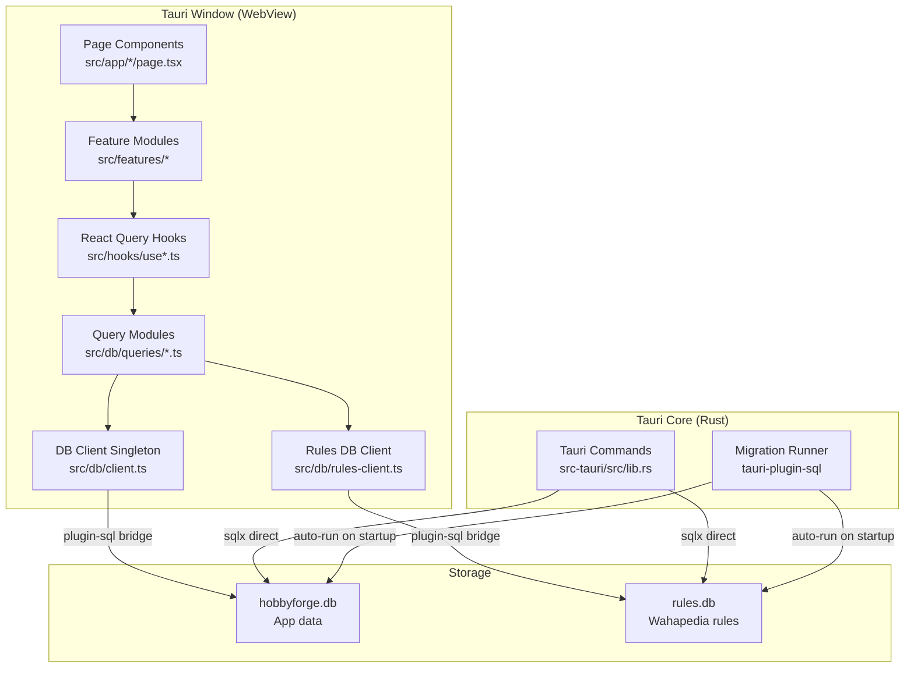

<!-- generated-by: gsd-doc-writer -->
# Architecture

HobbyForge is a Tauri 2 desktop application for managing all aspects of a Warhammer hobby — miniature collections, painting projects, paint inventory, army lists, battle logs, and spending. It uses a layered architecture with a React 19 frontend communicating with two local SQLite databases through Tauri's plugin-sql bridge. The Rust backend is intentionally thin, handling only bulk data operations and file system tasks that require native access.

## Component Diagram



## Data Flow

A typical user action (for example, creating a new unit) flows through the system as follows:

1. The user fills in a form inside a Sheet component (`src/features/units/UnitSheet.tsx`). The form is managed by React Hook Form with a Zod schema (`src/features/units/unitSchema.ts`) providing validation.
2. On submit, the form calls a React Query mutation hook (`useCreateUnit` from `src/hooks/useUnits.ts`).
3. The mutation hook invokes a query module function (`createUnit` from `src/db/queries/units.ts`), which builds a parameterized SQL INSERT using `$1, $2` positional syntax.
4. The query module calls `getDb()` from `src/db/client.ts` to obtain the singleton database connection. The singleton initializes on first use, running `PRAGMA foreign_keys = ON`, `PRAGMA journal_mode = WAL`, and `PRAGMA busy_timeout = 10000`.
5. The SQL executes through Tauri's plugin-sql bridge into the `hobbyforge.db` SQLite file at `%APPDATA%/com.hobbyforge.app/hobbyforge.db`.
6. On success, the mutation hook invalidates the relevant React Query cache key (e.g., `["units"]`), triggering any mounted query to refetch and the UI to update.

For the Wahapedia rules sync flow, the frontend parses CSV data and sends it as a structured payload to the Rust `bulk_sync_rules` command, which opens a direct sqlx connection to `rules.db`, disables foreign key checks, deletes all existing rows, bulk-inserts the new data, and commits in a single transaction.

For backup/restore operations, the Rust backend uses `VACUUM INTO` for consistent snapshots, packages them as `.zip` archives with a `metadata.json` manifest, and manages a safety backup directory at `%APPDATA%/com.hobbyforge.app/backups/`.

## Key Abstractions

| Abstraction | Location | Purpose |
|---|---|---|
| `getDb()` singleton | `src/db/client.ts` | Single SQLite connection with FK enforcement and WAL mode for `hobbyforge.db` |
| `getRulesDb()` singleton | `src/db/rules-client.ts` | Separate SQLite connection for read-only rules data (`rules.db`) |
| `DbHealthGate` | `src/components/common/DbHealthGate.tsx` | Startup gate that blocks rendering until database health check and schema version validation pass |
| `QueryProvider` | `src/components/common/QueryProvider.tsx` | Configures React Query with desktop-tuned defaults (5min stale, no window refocus, error logging) |
| `ActiveFactionContext` | `src/context/ActiveFactionContext.tsx` | Holds selected faction and mutates `--faction-accent` CSS variable for theme coloring |
| `QuickAddContext` | `src/context/QuickAddContext.tsx` | Provides global quick-add action accessible from any page |
| Entity type pattern | `src/types/*.ts` | Each entity defines `Entity`, `CreateEntityInput`, and `UpdateEntityInput` types |
| Zod form schemas | `src/features/*/entitySchema.ts` | Validation schemas co-located with feature modules, inferred as `EntityFormValues` |
| React Query hooks | `src/hooks/use*.ts` | One file per entity exporting `ENTITY_KEY`, `useEntity()` query, and mutation hooks |
| Query modules | `src/db/queries/*.ts` | One file per entity with CRUD functions using parameterized SQL |
| `bulk_sync_rules` | `src-tauri/src/lib.rs` | Rust Tauri command for atomic bulk-insert of Wahapedia CSV data into rules.db |
| `BackupManifest` | `src-tauri/src/lib.rs` | Serde struct for structured backup metadata (version, schema, platform, size) |
| Feature filter pattern | `src/features/*/applyEntityFilters.ts` + `entityFilters.ts` | Pure filter functions paired with Zustand stores for client-side filtering |

## State Management Layers

| Layer | Tool | What It Holds |
|---|---|---|
| Server/DB state | React Query (`@tanstack/react-query`) | All SQLite-backed data; 5-minute stale time, 10-minute GC, single retry |
| Filter/UI state | Zustand | Search text, dropdown selections, toggles per feature |
| Global app state | React Context | Active faction ID and accent color; quick-add state |
| Lightweight persistence | `localStorage` | Sidebar collapsed state, view mode preferences, active faction ID |

## Directory Structure Rationale

```
src/
  app/                  Page-level route components organized by URL path.
  │                     Each subdirectory contains a page.tsx with a lazy-loaded
  │                     named export consumed by TanStack Router.
  │
  features/             Feature modules organized by domain (one dir per entity).
  │                     Each contains schemas, sheets, cards/rows, filter logic,
  │                     and page-specific components — keeping domain logic
  │                     co-located rather than scattered by technical role.
  │
  components/
  │  ui/                shadcn/ui primitives (Button, Sheet, Dialog, etc.)
  │  common/            App shell components: layout, sidebar, query provider,
  │                     DB health gate, error boundaries.
  │  forms/             Shared form components (currently empty — forms live
  │                     in feature modules).
  │
  hooks/                React Query data hooks — one file per entity. Exports
  │                     cache keys, query hooks, and mutation hooks. This is
  │                     the API boundary between UI and data access.
  │
  db/
  │  client.ts          hobbyforge.db singleton connection.
  │  rules-client.ts    rules.db singleton connection.
  │  queries/           SQL query modules — one file per entity with CRUD
  │                     functions. The ONLY layer that writes raw SQL.
  │
  types/                Shared TypeScript interfaces and const arrays. Each
  │                     entity defines its shape, create input, and update input.
  │
  context/              React Context providers for cross-cutting concerns
  │                     (faction theming, quick-add).
  │
  lib/                  Pure utility functions with no React dependencies:
  │                     date formatting, currency, CSV parsing, diff computation,
  │                     points resolution, backup freshness checks.
  │
  styles/               globals.css with Tailwind v4 directives and CSS
                        custom properties for theming.

src-tauri/
  src/lib.rs            Rust entry point. Registers Tauri plugins, runs preflight
  │                     migration checksum repair, and exposes commands for
  │                     bulk sync, backup/restore, and file write.
  │
  migrations/           SQL migration files — 36 for hobbyforge.db, 4 for
                        rules.db. Auto-run at startup by tauri-plugin-sql in
                        filename order. Never edited after deployment.
```

## Two-Database Design

HobbyForge uses two separate SQLite databases to isolate concerns:

- **`hobbyforge.db`** — All user-created data: factions, units, paints, recipes, army lists, battle logs, spending, goals, and wishlist items. This database is the target of backup/restore operations. It has 36 migrations, enforces foreign keys, and uses WAL mode.

- **`rules.db`** — Wahapedia game rules data (datasheets, abilities, wargear, stratagems, detachments, points). This is a write-heavy database during sync operations (full delete-and-replace via the Rust `bulk_sync_rules` command). It has 4 migrations and uses WAL mode with a 10-second busy timeout to prevent lock contention during sync.

Both databases resolve to `%APPDATA%/com.hobbyforge.app/` on Windows. The Rust backend performs a preflight migration checksum repair on startup to prevent panics from migration file changes.

## Routing

The application uses TanStack Router (`src/app/router.tsx`) with two layout branches:

- **Standard layout** (`layoutRoute`) — Wraps pages in `AppLayout` (sidebar + header) with `ActiveFactionProvider` and Suspense. Contains 16 routes: dashboard (`/`), factions, collection, painting-projects, recipes, paints, army-lists, army-list detail (`/army-lists/$listId`), spending, wishlist, battle-log, goals, settings, rules-hub, game-day (`/game-day/$listId`), and data-health.

- **Bare layout** (`bareLayoutRoute`) — Distraction-free mode without sidebar. Currently hosts the painting-mode route (`/painting-mode/$assignmentId`).

All page components use named exports and are lazy-loaded via `React.lazy()` with adapter wrappers.

## Rust Backend Commands

The Rust backend (`src-tauri/src/lib.rs`) exposes 7 Tauri commands:

| Command | Purpose |
|---|---|
| `bulk_sync_rules` | Atomic bulk-insert of Wahapedia CSV data into rules.db |
| `export_backup` | VACUUM INTO + zip archive creation for structured backups |
| `validate_backup` | Read-only inspection of a backup zip for restore preview |
| `create_safety_backup` | Auto-generated safety backup in app data backups directory |
| `restore_from_backup` | Replace hobbyforge.db from a validated backup zip |
| `list_safety_backups` | List safety backup files sorted newest-first |
| `write_bytes_to_path` | Write raw bytes to a user-chosen path (used for PDF export) |
| `get_schema_version` | Return the current migration count for compatibility checks |

The backend also initializes 8 Tauri plugins: HTTP, updater, process, opener, filesystem, dialog, clipboard manager, and SQL (with migrations for both databases).
